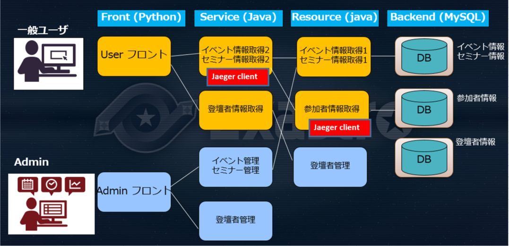
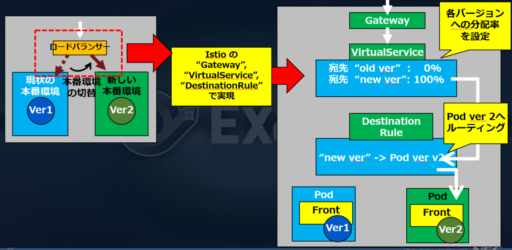

## 目次
&nbsp;&nbsp;・[ガイドライン概要](#ガイドライン概要)  
&nbsp;&nbsp;・[EPOCH カートリッジとは](#EPOCH&nbsp;カートリッジとは)  
&nbsp;&nbsp;・[マイクロサービスの分割について](#マイクロサービスの分割について)  
&nbsp;&nbsp;・[部品として利用していただけるコンポーネント](#部品として利用していただけるコンポーネント)  
&nbsp;&nbsp;・Exastro EPOCH による CI/CD  
&nbsp;&nbsp;・[高度なデプロイ](#高度なデプロイ)  
 

## ガイドライン概要
本ドキュメントは、EPOCH カートリッジを利用してクラウドネイティブシステムを構築するためのガイドです。
  

### 想定読者
本ドキュメントは以下の方を対象としております。  
&nbsp;&nbsp;クラウドネイティブアプリ開発に関心がある。  
&nbsp;&nbsp;github 操作の基礎知識がある。  
&nbsp;&nbsp;kubernetes の基礎知識がある。  
 

### 本ドキュメントの狙い
クラウドネイティブアプリ開発にあたり、どのように EPOCH カートリッジを利用して頂けるかを理解して頂くことです。
  

## EPOCH&nbsp;カートリッジとは
「イベントサイト」をテーマとしたクラウドネイティブアプリで、以下を実装したものです。
1. クラウドネイティブ実現に必須のマイクロサービスアーキテクチャ
2. Google 認証を利用した SSO ログイン
3. 各種監視ツール
4. Blue/Green デプロイメント等を実現するツール
5. セッション管理
 

 

本ドキュメントでは以下について解説致します。
1. 「イベントサイト」のアーキテクチャをもとにした、マイクロサービスの分割方法
2. 上記 2～5 を部品として他のクラウドネイティブアプリで利用する方法

では、これらについて見ていきましょう。
  

## マイクロサービスの分割について
イベントサイトは、以下のような画面フローをとります。

上記を実現するアーキテクチャは、モノリシック、マイクロサービスそれぞれで異なります。

<b>モノリシックアーキテクチャ</b>

 
<b>マイクロサービスアーキテクチャ</b>(イベントサイトはこちらを採用)

マイクロサービス化する際は「１つのマイクロサービスが "単一の責務" を持つこと。再利用可能であること」

という観点で分割します。

※「責務」の定義はいくつかありますが、ここでは 1DBへのアクセスと定義としました。

 
イベントサイトでの分割例

図内各マイクロサービスのコードは下記にあります。 (<-- ドキュメント末尾にリファレンスとして掲載?>)

<b>User</b>

User フロント 
https://github.com/exastro-suite/SettingSamples-epoch-Exastro_Days_Tokyo-front_user

イベント情報取得1 
https://github.com/exastro-suite/SettingSamples-epoch-Exastro_Days_Tokyo-event_user 

イベント情報取得2 
https://github.com/exastro-suite/SettingSamples-epoch-Exastro_Days_Tokyo-event_user

セミナー情報取得1 
https://github.com/exastro-suite/SettingSamples-epoch-Exastro_Days_Tokyo-event_user

セミナー情報取得2 
https://github.com/exastro-suite/SettingSamples-epoch-Exastro_Days_Tokyo-event_user

登壇者情報取得 
https://github.com/exastro-suite/SettingSamples-epoch-Exastro_Days_Tokyo-speaker-resource

参加者情報取得 
https://github.com/exastro-suite/SettingSamples-epoch-Exastro_Days_Tokyo-participant-resource
  

<b>Admin</b>

Admin フロント 
https://github.com/exastro-suite/SettingSamples-epoch-Exastro_Days_Tokyo-front_admin

イベント管理 
https://github.com/exastro-suite/SettingSamples-epoch-Exastro_Days_Tokyo-event_admin

セミナー管理

登壇者管理 
https://github.com/exastro-suite/SettingSamples-epoch-Exastro_Days_Tokyo-speaker_admin

参加者管理 
https://github.com/exastro-suite/SettingSamples-epoch-Exastro_Days_Tokyo-participant_admin
  

<b>DB</b>

イベント情報 
https://github.com/exastro-suite/SettingSamples-epoch-Exastro_Days_Tokyo-event-db

セミナー情報 
https://github.com/exastro-suite/SettingSamples-epoch-Exastro_Days_Tokyo-event-db

参加者情報 
https://github.com/exastro-suite/SettingSamples-epoch-Exastro_Days_Tokyo-participant-db

登壇者情報 
https://github.com/exastro-suite/SettingSamples-epoch-Exastro_Days_Tokyo-speaker-db
  

## 部品として利用していただけるコンポーネント
&nbsp;&nbsp;・[SSO](#SSO)  
&nbsp;&nbsp;・[監視ツール](#Monitor)  
&nbsp;&nbsp;&nbsp;&nbsp;&nbsp;&nbsp;・[ログ](#log)  
&nbsp;&nbsp;&nbsp;&nbsp;&nbsp;（[＋統合可視化ツール](#Visualization)）  
&nbsp;&nbsp;&nbsp;&nbsp;&nbsp;&nbsp;・[分散トレーシング](#Tracing)  
&nbsp;&nbsp;&nbsp;&nbsp;&nbsp;&nbsp;・[メトリクス](#Metrics)  

### <a id="SSO" />SSO
「Google ID を使った SSO ログインコンポーネント」を、部品として他のWebアプリでご利用頂く手順を説明します。

#### 事前準備
    以下リンクを参照の上 Google Client ID を取得しておいてください。
    https://support.google.com/workspacemigrate/answer/9222992?hl=ja

#### 手順
1. 対象リポジトリを Git clone

    以下を git clone してください。  
     
    https://github.com/exastro-suite/SettingSamples-epoch-Exastro_Days_Tokyo-front_user.git
 

2. 部品として使用するファイル

    以下を SSO ログイン用部品として使用します。

        front_user/templates/login/user_login.html

        front_user/views/user_login.py
 

3. 書き換え箇所
    ログイン後の遷移先を定義している user_login.html 内 54 行目 default_url の値を任意に書き換えます。

        54: var default_url = window.location.protocol + '//' + window.location.hostname + ':' + window.location.port;	
 

4. 環境変数

    user_login.py 内 31行目の SSO_GOOGLE_CLIENT_ID の値は 環境変数に事前に取得した Google Client IDをセットしておいてください。

    イベントサイトでは manifest にてセットしております。

    イベントサイト 用 IaC manifest 設定例 
    https://github.com/exastro-suite/SettingSamples-epoch-Exastro_Days_Tokyo-iac/blob/main/front-user.yaml
 

### <a id="Monitor" />監視ツール

#### 監視ツールについて
EPOCH カートリッジでは監視対象から下記 1～ 3 のデータを取得するためのツールに加え、これらを統合的に可視化するツールを部品として提供しています。  
1) ログ  
アプリ、kubernetest、コンテナなどから出力されるログを対象とします。  
EPOCH カートリッジでは Loki を使って実現しています。  

2) 分散トレーシング  
リクエストがアプリに届いてから、レスポンスが戻るまでの間の経路や、各コンポーネントでの所要時間です。  
EPOCH カートリッジでは Jaeger を使って実現しています。  

3) metrics   
一定時間毎に収集される各種測定値のことです。  
以下の2種類があります。  
&nbsp;&nbsp;アプリ側   metrics : EC サイトの売上、「カート」に入った個数等 <-- アプリに仕掛けが必要  
&nbsp;&nbsp;インフラ側 metrics : CPU、IO、負荷、メモリ等  
 
EPOCH カートリッジでは Prometheus を使ってインフラ側 metrics を取得しています。  

これら 1. ～ 3 を各ツールで取得し Grafana によって統合的に可視化します。  
   

これらの部品について次章以降で説明致します。  

#### <a id="log">ログ 監視
Loki を使って 各種ログの取得/可視化を実現しています。

Loki によって取得したログを可視化したもの  
  

##### Loki 構成図    
    
<table>
<tr>
<td>モジュール名</td><td>役割</td>
</tr>
<tr>
<td>①  Promtail</td><td>監視対象から各種ログを取得し、Loki に送信</td>
</tr>
<tr>
<td>②  Loki</td><td>送付されたログを受け取り、保存</td>
</tr>
</table>

##### 導入前提  
helm がインストールされていること。  
(Loki は helm を使って導入します。)  
 

##### 導入の流れ
1) Loki 用 チャートレポジトリ追加  
2) Loki インストール
3) service 名確認  

#### 1) Loki 用 チャートレポジトリ追加    
1) 以下のコマンドで Loki のチャートレポジトリを追加します。  
（"http://grafana..." とありますが、loki がはいっています)    
 >helm repo add loki https://grafana.github.io/loki/charts    

2) リポジトリが追加されたことを確認します。
>helm repo list

以下のように出力されていれば追加完了です。  
>NAME            URL
loki            https://grafana.github.io/loki/charts

 

#### 2) Loki インストール  
以下のコマンドで Loki をインストールします。  
>helm install -n ネームスペース loki/loki-stack --generate-name

 

#### 3) service 名確認 
Grafana 連携時に必要となる loki の service 名を取得します。 

1) 以下のコマンドを入力します。  
>kubectl get service -n ネームスペース

2) 一覧のうち loki-stack-xxxx というサービス名をひかえておきます。
(次章で使用します。)  
    

ここまでで Loki の設定がおわりました。  
次章では Loki によって取得したログを可視化するために必要な統合可視化ツール Grafana について説明を致します。  
Grafana の章で Loki と Grafana の連携し、取得したログを可視化します。  

 

#### <a id="Visualization">統合可視化ツール
統合可視化ツール Grafana の導入によって Loki で取得したログや、Jaeger、Prometheus (次章以降で説明) で取得した分散トレーシング、metrics を可視化することができます。  

導入の流れ  
1) Grafana インストール  
2) Grafana 動確  
3) Grafana と Loki の連携  
4) 動確  

#### 1)  Grafana インストール  
1-1) 作業用ディレクトリ配下に grafana ディレクトリを作成し、カレントをそこへ変更します。  
>mkdir ./grafana  
cd ./grafana

1-2) Service Account の作成  
curl -O https://raw.githubusercontent.com/exastro-suite/SettingSamples-epoch-Exastro_Days_Tokyo-iac/main/reusable_component/grafana/grafana-sa.yaml  

namespace を適宜書き換えます。  

apply実施    
kubectl apply -f ./grafana-sa.yaml  

1-3) ConfigMap の設定  
kubectl apply -f https://raw.githubusercontent.com/exastro-suite/SettingSamples-epoch-Exastro_Days_Tokyo-iac/main/reusable_component/grafana/grafana-configmap.yaml -n 対象ネームスペース  

1-4) Grafana Deployment  
kubectl apply -f https://raw.githubusercontent.com/exastro-suite/SettingSamples-epoch-Exastro_Days_Tokyo-iac/main/reusable_component/grafana/grafana-deployment.yaml -n 対象ネームスペース  

#### 2) Grafana 動確   
以下の URL で Grafana UI にアクセスできます。  
http://Grafana を導入したホスト名:30400  
Username: admin  
Password: admin  

#### 3) Grafana と Loki の連携   
あらためて Grafana UI にアクセスします。  
http://"Grafana を導入したホスト名":30400  
Username: admin  
Password: admin  

Grafana にログイン後  
Configuration (歯車アイコン) > Datasource  

Add data source を押下します。  

一覧から Loki の "Select" を押下します。  

URL 入力欄に以下を入力します。  
<b>http://loki-stack-xxxx:3100</b>    

画面最下部にある "Save & Test" を押下します。  

"Data source connected and service found" と出れば Loki との連携完了です。  

 

#### 5) UI 確認  
Grafana から Loki で取得したログをみてみましょう。  
※あらかじめ対象アプリにリクエストを発生させておきます。  

画面左から Explore を押下します。  

 

"Explore" の右側にあるプルダウンから Loki を選択します。  

 

"Log Browser" をクリックすると、取得可能なログのカテゴリが出ます。  
ここでは name を選択します。  

 
name 配下の front-user を押下後 "Show logs" を押下します。  

 (マイクロサービス "front-user" コンポーネントのが出力するログを選択)  

ログが画面下半分に表示されます。  

同様な流れで Jaeger、Prometheus から取得したデータも Grafana で可視化できます。  
 

#### <a id="Tracing" />分散トレーシング  
Spring boot ベースのアプリケーションを対象として Jaeger を使った分散トレースを実現しています。  

分散トレースのイメージ  
  

Jaeger でイベントサイトの分散トレースを実施した結果      
  
    
 

##### Jaeger構成図    
    
<table>
<tr>
<td>モジュール名</td><td>役割</td><td>実現方法</td>
</tr>
<tr>
<td>①  jaeger-client</td><td>リクエストからトレーシングの元となる「スパン」を取得</td><td>対象コンポーネントの pom.xml ファイル内で設定</td>
</tr>
<tr>
<td>②  jaeger-agent</td><td>スパンを受信し、Jaeger-collector へトレースを push</td><td>対象コンポーネントの Deployment manifest へ agent 関連を追記</td>
</tr>
<tr>
<td>③  jaeger-collector</td><td>受け取ったトレースの検証、インデックスを付与しストレージに格納</td><td>jaeger-all-in-one-inmemory.yaml</td>
</tr>
<tr>
<td>④  jaeger-query</td><td>ストレージからトレースを参照し UI に表示</td><td>jaeger-all-in-one-inmemory.yaml</td>
</tr>
</table>

##### 導入の流れ
1) Jaeger-client の設定    
2) Jaeger-operator の設定  
3) Jaeger-agent の設定  
4) Jaeger-collector, Jaeger-query の設定    
5) Jaeger 用 node port の設定 
6) 分散トレーシング内各要素に付与する名前の定義  
7) Grafana との連携  
 

##### 1) Jaeger-client の設定
Jaeger-client を、分散トレーシングの対象としたいコンポーネントに設定します。   
以下の例では、２つのコンポーネントが可視化されます。  
   

Jaeger-client の設定方法  
分散トレーシング対象とするコンポーネント内 pom.xml の \<dependencies> に下記を追加します。  

		<!-- https://mvnrepository.com/artifact/io.opentracing.contrib/opentracing-spring-web-starter -->
		<dependency>
			<groupId>io.opentracing.contrib</groupId>
			<artifactId>opentracing-spring-web-starter</artifactId>
			<version>4.0.0</version>
		</dependency>
		<!-- https://mvnrepository.com/artifact/io.opentracing.contrib/opentracing-spring-jaeger-web-starter -->
		<dependency>
			<groupId>io.opentracing.contrib</groupId>
			<artifactId>opentracing-spring-jaeger-web-starter</artifactId>
			<version>3.2.2</version>
		</dependency>

#### 2) Jaeger-operator の設定  
Jaeger 用リソース追加のため、以下の manifest によって Jaeger Operator をインストールします。  
1) Jaeger CR定義  
kubectl create -f https://raw.githubusercontent.com/jaegertracing/jaeger-operator/v1.17.0/deploy/crds/jaegertracing.io_jaegers_crd.yaml

2)  Service Account定義  
kubectl create -f https://raw.githubusercontent.com/jaegertracing/jaeger-operator/v1.17.0/deploy/service_account.yaml -n 対象ネームスペース

3) role定義  
kubectl create -f https://raw.githubusercontent.com/jaegertracing/jaeger-operator/v1.17.0/deploy/role.yaml -n 対象ネームスペース

4) role binding 定義  
kubectl create -f https://raw.githubusercontent.com/jaegertracing/jaeger-operator/v1.17.0/deploy/role_binding.yaml -n 対象ネームスペース

5) Jaeger Deployment  
kubectl create -f https://raw.githubusercontent.com/jaegertracing/jaeger-operator/v1.17.0/deploy/operator.yaml -n 対象ネームスペース  

#### 3) Jager-agent の設定
対象コンポーネントの Deployment manifest 内に下記の通り追加します。    
>apiVersion: apps/v1  
kind: Deployment  
metadata:  
&nbsp;&nbsp;&nbsp;&nbsp;creationTimestamp: null  
    version: v1  
&nbsp;&nbsp;&nbsp;&nbsp;name: event-user-v1  
&nbsp;&nbsp;&nbsp;&nbsp;namespace: exastro-days-tokyo  
&nbsp;&nbsp;&nbsp;&nbsp;<b>annotations:  
&nbsp;&nbsp;&nbsp;&nbsp;&nbsp;&nbsp;&nbsp;sidecar.jaegertracing.io\/inject: "true"</b>  

#### 4) Jaeger-collector, Jaeger-query の設定
Jaeger-collector, Jaeger-query は１つの manifest "jaeger-all-in-one-inmemory.yaml" によって導入できます。

 kubectl apply -f https://raw.githubusercontent.com/exastro-suite/SettingSamples-epoch-Exastro_Days_Tokyo-iac/main/reusable_component/jaeger-all-in-one-inmemory.yaml -n 対象ネームスペース     
 

#### 5) Jaeger 用 node port の設定  
Jaeger UI アクセス用の port を設定します。  
 kubectl apply -f .https://raw.githubusercontent.com/exastro-suite/SettingSamples-epoch-Exastro_Days_Tokyo-iac/main/reusable_component/jaeger-query-nodeport.yaml -n 対象ネームスペース     
 

#### 6) 分散トレーシング内各要素に付与する名前の定義
対象コンポーネントの Deployment manifest 内 spec.template.meetadata.labels.app にて分散トレーシング内各要素の名前を定義します。  
>apiVersion: apps/v1  
kind: Deployment  
metadata:  
&nbsp;&nbsp;&nbsp;&nbsp;creationTimestamp: null  
&nbsp;&nbsp;&nbsp;&nbsp;labels:  
&nbsp;&nbsp;&nbsp;&nbsp;&nbsp;&nbsp;&nbsp;app: event-user  
    version: v1  
&nbsp;&nbsp;&nbsp;&nbsp;name: event-user-v1  
&nbsp;&nbsp;&nbsp;&nbsp;namespace: exastro-days-tokyo  
spec:  
&nbsp;&nbsp;&nbsp;&nbsp;template:  
&nbsp;&nbsp;&nbsp;&nbsp;&nbsp;&nbsp;&nbsp;&nbsp;metadata:  
&nbsp;&nbsp;&nbsp;&nbsp;&nbsp;&nbsp;&nbsp;&nbsp;&nbsp;&nbsp;&nbsp;&nbsp;<b>labels:  
&nbsp;&nbsp;&nbsp;&nbsp;&nbsp;&nbsp;&nbsp;&nbsp;&nbsp;&nbsp;&nbsp;&nbsp;&nbsp;&nbsp;&nbsp;&nbsp;app: event-user</b>   

spec.selector.app に設定した文字列が、各分散トレースのラベルとなります。  
以下は spec.template.meetadata.labels.app に "event-user" と設定した時の Jaeger の画面です。  
  

対象コンポーネントの Deployment manifest 書換後、apply します。  
    kubectl apply -f 対象コンポーネントの manifest  -n 対象ネームスペース

#### 7) Grafana と Jaeger の連携
Jaeger で収集したトレースを Grafana UI でみてみましょう。  
※あらかじめ対象アプリにリクエストを発生させておきます。  

Grafana にログイン後  
Configuration (歯車アイコン) > Datasource  

Add data source を押下します。　　  
  

一覧から Jaeger の "Select" を押下します。

URL 入力欄に以下を入力します。  
<b>http://jaeger-all-in-one-inmemory-query:16686</b>    

画面最下部にある "Save & Test" を押下します。  

"Data source connected and service found" と出れば Jaeger との連携完了です。  

 

Grafana から Jaeger で取得した分散トレーシングをみてみましょう。  
画面左から Explore を押下します。  

Search を押下します。  

Service 欄にトレース一覧がでてくるので１つを選択します。  

 

画面右上の Run Query を押下します。  

画面下半分に出るトレース一覧のうち１つを押下すると、右側に分散トレーシングが可視化されます。  

#### <a id="Metrics" />Metrics 取得    
Metrics 取得ツール Prometheus の導入方法を説明します。  

##### Prometheus 構成図    
    
<table>
<tr>
<td>モジュール名</td><td>役割</td><td>実現方法</td>
</tr>
<tr>
<td>①  exporter</td><td>監視対象から CPU リソース等の metrics を取得</td><td></td>
</tr>
<tr>
<td>②  Retrieval</td><td>リソース情報を exporter から取得</td><td></td>
</tr>
<tr>
<td>③  storage</td><td>リソース情報を格納</td><td></td>
</tr>
<tr>
<td>④  PromQL</td><td>リソース情報を可視化</td><td></td>
</tr>
</table>

##### 導入の流れ
1) Prometheus 用 manifest ダウンロード  
2) manifest ネームスペース書換  
3) apply   
4) Grafana と Prometheus の連携  
5) UI 確認   

#### 1) Prometheus 用 manifest ダウンロード    
作業用ディレクトリ配下に prometheus ディレクトリ作成し、カレントを移動します。  
>mkdir ./prometheus  
cd ./prometheus

以下をダウンロードします。  
1) node exporter  
curl -O https://raw.githubusercontent.com/exastro-suite/SettingSamples-epoch-Exastro_Days_Tokyo-iac/main/reusable_component/prometheus/node-exporter.yaml  

2) Service Account定義  
curl -O https://raw.githubusercontent.com/exastro-suite/SettingSamples-epoch-Exastro_Days_Tokyo-iac/main/reusable_component/prometheus/prometheus_sa.yaml  

3) Config Map 定義  
curl -O https://raw.githubusercontent.com/exastro-suite/SettingSamples-epoch-Exastro_Days_Tokyo-iac/main/reusable_component/prometheus/prometheus-configmap.yaml  

4) Deployment  
curl -O https://raw.githubusercontent.com/exastro-suite/SettingSamples-epoch-Exastro_Days_Tokyo-iac/main/reusable_component/prometheus/prometheus-deployment.yaml  

5) 永続化用 (pv)  
curl -O https://raw.githubusercontent.com/exastro-suite/SettingSamples-epoch-Exastro_Days_Tokyo-iac/main/reusable_component/prometheus/prometheus-pv.yaml  

6) 永続化用 (pvc)  
curl -O https://raw.githubusercontent.com/exastro-suite/SettingSamples-epoch-Exastro_Days_Tokyo-iac/main/reusable_component/prometheus/prometheus-pvc.yaml  

#### 2) manifest ネームスペース書換  
prometheus_sa.yaml 内ネームスペースを任意に書き換えます。  
>apiVersion: rbac.authorization.k8s.io/v1  
kind: ClusterRoleBinding  
metadata:  
&nbsp;&nbsp;name: prometheus  
roleRef:  
&nbsp;&nbsp;apiGroup: rbac.authorization.k8s.io  
&nbsp;&nbsp;kind: ClusterRole  
&nbsp;&nbsp;name: prometheus  
subjects:  
\- kind: ServiceAccount  
&nbsp;&nbsp;name: prometheus  
&nbsp;&nbsp;namespace: <b>対象ネームスペース</b> #<-- 書換  

#### 3)  apply  
cd ../  
kubectl apply -f ./prometheus -n 対象ネームスペース  

#### 4) Grafana と Prometheus の連携   
以下の URL で Grafana UI にアクセスします。  
http://"Grafana を導入したホスト名":30400  
Username: admin  
Password: admin  

Grafana にログイン後  
Configuration (歯車アイコン) > Datasource  

Add data source を押下します。  
  

一覧から Prometheus の "Select" を押下します。  

URL 入力欄に以下を入力します。  
http://prometheus:9090    

画面最下部にある "Save & Test" を押下します。  

 

"Data source connected and service found" と出れば Prometheus との連携完了です。  

 

#### 5) UI 確認  
Grafana から Prometheus で取得した metrics をみてみましょう。  
画面左から Explore を押下します。  

 

"Explore " の右側にあるプルダウンから Prometheus を選択します。  

 

"Metric Browser" 欄に、取得したい metrics 名 (の一部) を入力します。  
cpu を入力すると、cpu 関連の metrics 候補が出てくるので node_cpu_seconds_total を選択します。  

 

画面右上の Run Query を押下します。  

該当する metrics が画面下半分に表示されます。  

## 高度なデプロイ
### Blue/Green デプロイとは
現状の本番環境（ブルー）とは別の、新しい本番環境（グリーン）を用意しロードバランサーの接続先を切り替えるなどして新しい本番環境をリリースすることです。

EPOCH カートリッジでは Istio を用いて Blue/Green デプロイメントを実現しています。  
EPOCH カートリッジ内 Blue/Green 用 manifest (for Istio) を一部書き換えることで他のアプリに対して Blue/Green デプロイメントを実施することができます。
 
### 前提
version1, version2 ２つの Deployment をもつ manifest が用意されていること。  
 

EPOCH カートリッジの Deployment manifest (front-user.yaml) 抜粋
>apiVersion: apps/v1  
kind: Deployment  
metadata:  
&nbsp;&nbsp;&nbsp;&nbsp;namespace: exastro-days-tokyo
&nbsp;&nbsp;&nbsp;&nbsp;name: front-user-v1  
&nbsp;&nbsp;&nbsp;&nbsp;labels:  
&nbsp;&nbsp;&nbsp;&nbsp;&nbsp;&nbsp;&nbsp;app: front-user  
&nbsp;&nbsp;&nbsp;&nbsp;&nbsp;&nbsp;&nbsp;version: <b>v1</b>  
spec:  
&nbsp;&nbsp;&nbsp;replicas: 1  
&nbsp;&nbsp;&nbsp;selector:  
&nbsp;&nbsp;&nbsp;&nbsp;&nbsp;&nbsp;matchLabels:  
&nbsp;&nbsp;&nbsp;&nbsp;&nbsp;&nbsp;&nbsp;&nbsp;&nbsp;&nbsp;&nbsp;app: front-user  
&nbsp;&nbsp;&nbsp;&nbsp;&nbsp;&nbsp;&nbsp;&nbsp;&nbsp;&nbsp;&nbsp;version: <b>v1</b>  
&nbsp;&nbsp;&nbsp;template:  
&nbsp;&nbsp;&nbsp;&nbsp;&nbsp;&nbsp;metadata:  
&nbsp;&nbsp;&nbsp;&nbsp;&nbsp;&nbsp;&nbsp;&nbsp;&nbsp; labels:  
&nbsp;&nbsp;&nbsp;&nbsp;&nbsp;&nbsp;&nbsp;&nbsp;&nbsp;&nbsp;&nbsp;&nbsp;app: front-user  
&nbsp;&nbsp;&nbsp;&nbsp;&nbsp;&nbsp;&nbsp;&nbsp;&nbsp;&nbsp;&nbsp;&nbsp;version: <b>v1</b>  
    spec:  
…  中略 …  
apiVersion: apps/v1  
kind: Deployment  
metadata:  
&nbsp;&nbsp;&nbsp;&nbsp;namespace: exastro-days-tokyo  
&nbsp;&nbsp;&nbsp;&nbsp;name: front-user-v2  
&nbsp;&nbsp;&nbsp;&nbsp;labels:  
&nbsp;&nbsp;&nbsp;&nbsp;&nbsp;&nbsp;&nbsp;app: front-user  
&nbsp;&nbsp;&nbsp;&nbsp;&nbsp;&nbsp;&nbsp;version: <b>v2</b>  
spec:  
&nbsp;&nbsp;&nbsp;replicas: 1  
&nbsp;&nbsp;&nbsp;selector:  
&nbsp;&nbsp;&nbsp;&nbsp;&nbsp;&nbsp;matchLabels:  
&nbsp;&nbsp;&nbsp;&nbsp;&nbsp;&nbsp;&nbsp;&nbsp;&nbsp;&nbsp;&nbsp;app: front-user  
&nbsp;&nbsp;&nbsp;&nbsp;&nbsp;&nbsp;&nbsp;&nbsp;&nbsp;&nbsp;&nbsp;version: <b>v2</b>  
&nbsp;&nbsp;&nbsp;template:  
&nbsp;&nbsp;&nbsp;&nbsp;&nbsp;&nbsp;metadata:  
&nbsp;&nbsp;&nbsp;&nbsp;&nbsp;&nbsp;&nbsp;&nbsp;&nbsp; labels:  
&nbsp;&nbsp;&nbsp;&nbsp;&nbsp;&nbsp;&nbsp;&nbsp;&nbsp;&nbsp;&nbsp;&nbsp;app: front-user  
&nbsp;&nbsp;&nbsp;&nbsp;&nbsp;&nbsp;&nbsp;&nbsp;&nbsp;&nbsp;&nbsp;&nbsp;<b>v2</b>  
    spec:  
...

 

### 準備
Blue/Greenデプロイメントの対象とするサービス manifest 内 metadata.app の値を控えておいてください。  
後ほど使用いたします。  
 
front-user.yaml の場合  
>apiVersion: apps/v1  
kind: Deployment  
metadata:  
&nbsp;&nbsp;&nbsp;&nbsp;namespace: exastro-days-tokyo  
&nbsp;&nbsp;&nbsp;&nbsp;name: front-user-v1  
&nbsp;&nbsp;&nbsp;&nbsp;labels:  
&nbsp;&nbsp;&nbsp;&nbsp;&nbsp;&nbsp;&nbsp;app: <b>front-user</b>  
 
### Blue/Green デプロイメント実施の流れ  

    istio インストール  
    Blue/Green 用 manifest 入手  
    上記 manifest 設定  
    対象 Deployment manifest へ istio inject  実施  
    上記 manifest の apply  
    URL アクセス (Blue/Green デプロイメント前)  
    Blue/Green デプロイメント実施  
    URL アクセス (Blue/Green デプロイメント後)  

 

### <b>istio インストール</b>
ダウンロード  
curl -L https://istio.io/downloadIstio | sh -  
cd ./istio-1.11.3 (←ディレクトリ名はバージョンによって異なります。)  
export PATH=$PWD/bin:$PATH

--バージョンの確認--  
istioctl version

>no running Istio pods in "istio-system"  
    1.11.3

 

Istio の設定  
istioctl install --set profile=demo -y

以下の通り Installation complete が出ればインストール完了です。  
>Installation complete  
>Thank you for installing Istio 1.11.Please take a few minutes to tell us about your install/upgrade experience!  https://forms.gle/kWULBRjUv7hHci7T6
   

### <b>Blue/Green デプロイメント用 manifest 入手</b>
Blue/Green デプロイメントに必要な manifest は以下の３つです。
>Gateway … 外部リクエストのフォワード関連を定義   
VirtualService … v1, v2 の Pod の振り分け比率を定義  
DestinationRule  … VirtualService と Pod を紐づけ  

  

これらのファイルを入手するために以下を git clone します。  
https://github.com/exastro-suite/SettingSamples-epoch-Exastro_Days_Tokyo-iac.git

３つは以下 manifest にまとまっています。   
>/manifest_template/bluegreen-deployment.yaml 
 

### <b>manifest 設定</b>
1) 以下赤字箇所を Deployment manifest 内 metadata.labels.app と同じ値に設定します。
2) namespace を Deployment manifest と同じものに書き換えます。
 

<b>bluegreen-deployment.yaml 内 VirtualService 部分</b>  
>apiVersion: networking.istio.io/v1alpha3  
kind: VirtualService  
metadata:  
&nbsp;&nbsp;&nbsp;&nbsp;  name: <b>front-user</b>  
&nbsp;&nbsp;&nbsp;&nbsp;  namespace: <b>exastro-days-tokyo</b>  
spec:  
&nbsp;&nbsp;&nbsp;&nbsp;  hosts:  
&nbsp;&nbsp;&nbsp;&nbsp;    - "*"  
&nbsp;&nbsp;&nbsp;&nbsp;  gateways:  
&nbsp;&nbsp;&nbsp;&nbsp;    - front-user-gateway  
&nbsp;&nbsp;&nbsp;&nbsp;  http:  
&nbsp;&nbsp;&nbsp;&nbsp;    - name: <b>front-user</b>  
&nbsp;&nbsp;&nbsp;&nbsp;&nbsp;&nbsp;&nbsp;&nbsp;route:  
&nbsp;&nbsp;&nbsp;&nbsp;&nbsp;&nbsp;&nbsp;&nbsp;- destination:  
&nbsp;&nbsp;&nbsp;&nbsp;&nbsp;&nbsp;&nbsp;&nbsp;&nbsp;&nbsp;&nbsp;&nbsp;&nbsp;&nbsp;&nbsp;host: <b>front-user</b>  
&nbsp;&nbsp;&nbsp;&nbsp;&nbsp;&nbsp;&nbsp;&nbsp;&nbsp;&nbsp;&nbsp;&nbsp;&nbsp;&nbsp;&nbsp;port:  
&nbsp;&nbsp;&nbsp;&nbsp;&nbsp;&nbsp;&nbsp;&nbsp;&nbsp;&nbsp;&nbsp;&nbsp;&nbsp;&nbsp;&nbsp;&nbsp;&nbsp;&nbsp;&nbsp;number: 5000  
&nbsp;&nbsp;&nbsp;&nbsp;&nbsp;&nbsp;&nbsp;&nbsp;&nbsp;&nbsp;&nbsp;&nbsp;&nbsp;&nbsp;&nbsp;subset: v1  
&nbsp;&nbsp;&nbsp;&nbsp;&nbsp;&nbsp;&nbsp;&nbsp;&nbsp;&nbsp;&nbsp;weight: 100  # <--Pod v1 へ 100%割り振り  
&nbsp;&nbsp;&nbsp;&nbsp;&nbsp;&nbsp;&nbsp;&nbsp;- destination:  
&nbsp;&nbsp;&nbsp;&nbsp;&nbsp;&nbsp;&nbsp;&nbsp;&nbsp;&nbsp;&nbsp;&nbsp;&nbsp;&nbsp;&nbsp;host: <b>front-user</b>  
&nbsp;&nbsp;&nbsp;&nbsp;&nbsp;&nbsp;&nbsp;&nbsp;&nbsp;&nbsp;&nbsp;&nbsp;&nbsp;&nbsp;&nbsp;port:  
&nbsp;&nbsp;&nbsp;&nbsp;&nbsp;&nbsp;&nbsp;&nbsp;&nbsp;&nbsp;&nbsp;&nbsp;&nbsp;&nbsp;&nbsp;&nbsp;&nbsp;&nbsp;&nbsp;number: 5000  
&nbsp;&nbsp;&nbsp;&nbsp;&nbsp;&nbsp;&nbsp;&nbsp;&nbsp;&nbsp;&nbsp;&nbsp;&nbsp;&nbsp;&nbsp;subset: v2  
&nbsp;&nbsp;&nbsp;&nbsp;&nbsp;&nbsp;&nbsp;&nbsp;&nbsp;&nbsp;&nbsp;weight: 0 # <--Pod v2 へ 0%割り振り  
 

### <b>istio inject</b> 
「istioctl kube-inject」コマンドで Istio のサイドカープロキシを挿入します。  
>istioctl kube-inject -f 対象manifest > 出力先 manifest 

### <b>apply その1</b>
Gateway, VirtualService, DestinationRule を apply します。  
kubectl apply -f ./bluegreen-deployment.yaml   -n <i>対象ネームスペース</i>

現在の bluegreen-deployment.yaml では以下の通り設定されているのでリクエストはすべて v1 へ割り振られます。  
>…  
&nbsp;&nbsp;&nbsp;&nbsp;&nbsp;&nbsp;&nbsp;&nbsp;- destination:  
&nbsp;&nbsp;&nbsp;&nbsp;&nbsp;&nbsp;&nbsp;&nbsp;&nbsp;&nbsp;&nbsp;&nbsp;&nbsp;&nbsp;&nbsp;host: <b>front-user</b>  
&nbsp;&nbsp;&nbsp;&nbsp;&nbsp;&nbsp;&nbsp;&nbsp;&nbsp;&nbsp;&nbsp;&nbsp;&nbsp;&nbsp;&nbsp;port:  
&nbsp;&nbsp;&nbsp;&nbsp;&nbsp;&nbsp;&nbsp;&nbsp;&nbsp;&nbsp;&nbsp;&nbsp;&nbsp;&nbsp;&nbsp;&nbsp;&nbsp;&nbsp;&nbsp;number: 5000  
&nbsp;&nbsp;&nbsp;&nbsp;&nbsp;&nbsp;&nbsp;&nbsp;&nbsp;&nbsp;&nbsp;&nbsp;&nbsp;&nbsp;&nbsp;subset: v1  
&nbsp;&nbsp;&nbsp;&nbsp;&nbsp;&nbsp;&nbsp;&nbsp;&nbsp;&nbsp;&nbsp;weight: <b>0</b> # <--Pod v1 へ 100%割り振り  
…
 

### <b>URL アクセス (Blue/Green デプロイメント前)</b>  
外部からのアクセス用ポート番号を確認します。  
以下のコマンドを入力します
> kubectl get service -n istio-system  

Webアプリで使用しているポート番号に紐づくポート番号を使用して URL アクセスします。  
EPOCH カートリッジの Webアプリ「イベントサイト」の場合、ポート番号は 80 なので 32439 を使ってアクセスします。

http://デプロイ先のIPアドレス等:32439

### <b>apply その2</b>
v2 へ切り替える際には bluegreen-deployment.yaml を以下の通り変更後再度 apply します。  
...  
&nbsp;&nbsp;&nbsp;&nbsp;&nbsp;&nbsp;&nbsp;&nbsp;- destination:  
&nbsp;&nbsp;&nbsp;&nbsp;&nbsp;&nbsp;&nbsp;&nbsp;&nbsp;&nbsp;&nbsp;&nbsp;&nbsp;&nbsp;&nbsp;host: front-user  
&nbsp;&nbsp;&nbsp;&nbsp;&nbsp;&nbsp;&nbsp;&nbsp;&nbsp;&nbsp;&nbsp;&nbsp;&nbsp;&nbsp;&nbsp;port:  
&nbsp;&nbsp;&nbsp;&nbsp;&nbsp;&nbsp;&nbsp;&nbsp;&nbsp;&nbsp;&nbsp;&nbsp;&nbsp;&nbsp;&nbsp;&nbsp;&nbsp;&nbsp;&nbsp;number: 5000  
&nbsp;&nbsp;&nbsp;&nbsp;&nbsp;&nbsp;&nbsp;&nbsp;&nbsp;&nbsp;&nbsp;&nbsp;&nbsp;&nbsp;&nbsp;subset: v1  
&nbsp;&nbsp;&nbsp;&nbsp;&nbsp;&nbsp;&nbsp;&nbsp;&nbsp;&nbsp;&nbsp;weight: <b>0</b>  # <--Pod v1 へ 0% 割り振り  
&nbsp;&nbsp;&nbsp;&nbsp;&nbsp;&nbsp;&nbsp;&nbsp;- destination:  
&nbsp;&nbsp;&nbsp;&nbsp;&nbsp;&nbsp;&nbsp;&nbsp;&nbsp;&nbsp;&nbsp;&nbsp;&nbsp;&nbsp;&nbsp;host: front-user  
&nbsp;&nbsp;&nbsp;&nbsp;&nbsp;&nbsp;&nbsp;&nbsp;&nbsp;&nbsp;&nbsp;&nbsp;&nbsp;&nbsp;&nbsp;port:  
&nbsp;&nbsp;&nbsp;&nbsp;&nbsp;&nbsp;&nbsp;&nbsp;&nbsp;&nbsp;&nbsp;&nbsp;&nbsp;&nbsp;&nbsp;&nbsp;&nbsp;&nbsp;&nbsp;number: 5000  
&nbsp;&nbsp;&nbsp;&nbsp;&nbsp;&nbsp;&nbsp;&nbsp;&nbsp;&nbsp;&nbsp;&nbsp;&nbsp;&nbsp;&nbsp;subset: v2  
&nbsp;&nbsp;&nbsp;&nbsp;&nbsp;&nbsp;&nbsp;&nbsp;&nbsp;&nbsp;&nbsp;weight: <b>100</b> # <--Pod v2 へ 100%　割り振り  
 

kubectl apply -f ./bluegreen-deployment.yaml   -n <i>対象ネームスペース</i>　　

### <b>URL アクセス (Blue/Green デプロイメント後)</b>  
http://デプロイ先のIPアドレス等:32439

